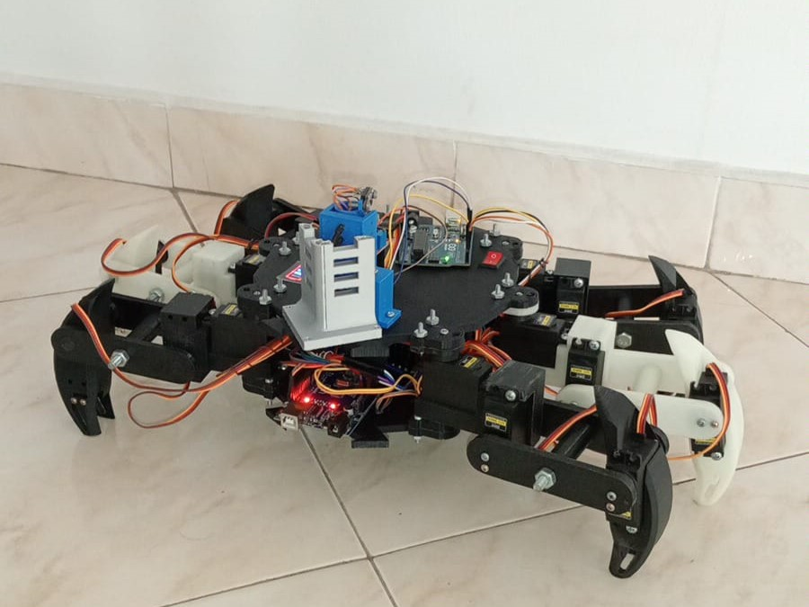
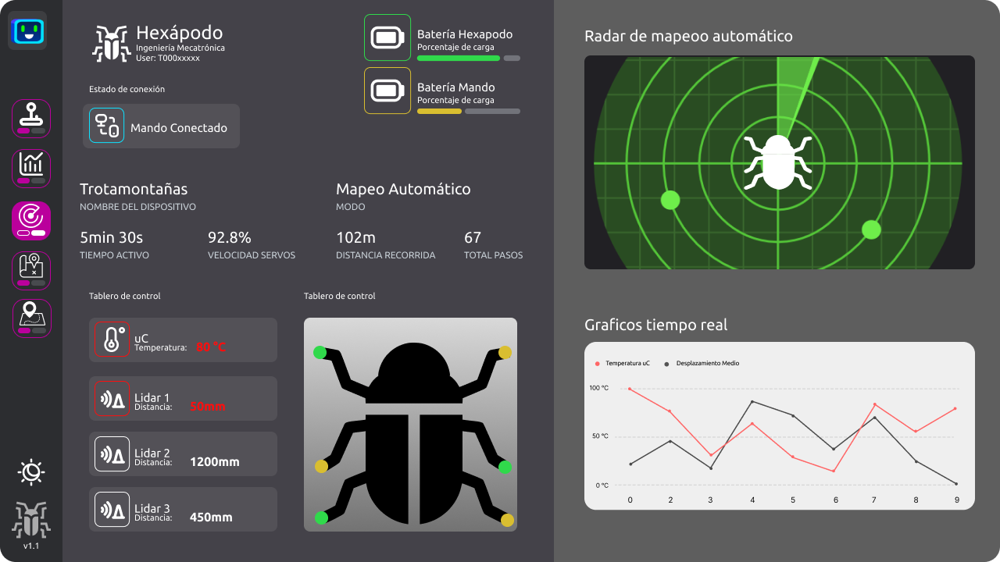
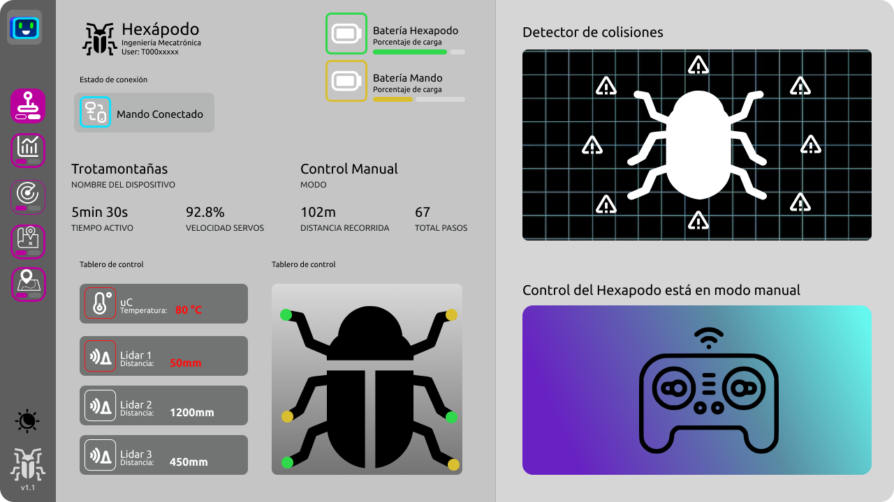

# HEX-PLORER


**Este proyecto consiste en el desarrollo de un prototipo de hexápodo capaz de mapear y detectar condiciones irregulares en un área determinada. El robot posee un control para controlarlo a distancia y varias modalidades.**


---

## **Índice**

1. [Introducción](#introducción)  
2. [Características](#características)  
3. [Instalación](#instalación)  
4. [Uso](#uso)  
5. [Configuración](#configuración)  
6. [Contribuciones](#contribuciones)  
7. [Roadmap](#roadmap)  
8. [Licencia](#licencia)  
9. [Contacto](#contacto)  

---

## **Introducción**

Este hexápodo representa una plataforma 
versátil para mapeo y teledetección en zonas de difícil acceso, con 
múltiples aplicaciones potenciales.  

---

## **Características**

- Caracteristicas principales del robot.  
  - Autonomía de apoximadamente 30 min  
  - Capacidad de detectar obstaculos de forma horizontal en un radio 80cm de su centroide.
- Caracteristicas principales de la interfaz hombre-maquina (HMI).
    - Mando Bluetooth para controlar de manera remota el Hexapodo
    - Interfaz de escritorio para análisis detallado de los sensores

---

## **Instalación**

### Requisitos previos

- VS Code.  
    - Extension: Pack for Java 
    - Extension: Maeven.
    - Projecto Manager for java

### Pasos

```bash
# Clona el repositorio
git clone https://github.com/iCruzDaniel/HEX-PLORER.git

```

---

<!-- ## **Uso**

1. Explica cómo ejecutar o usar el proyecto, paso a paso.  
2. Proporciona ejemplos de comandos o snippets de código:

```bash
# Ejecutar en modo desarrollo
npm run dev

# Construir para producción
npm run build
```

3. Si aplica, incluye capturas de pantalla o gifs mostrando el proyecto en acción. -->

---

<!-- ## **Configuración**

- Detalles sobre archivos de configuración como `.env`, `config.json`, etc.  
- Variables de entorno importantes:

```env
API_KEY=tu_api_key
DB_HOST=localhost
``` -->

---
<!-- ## **Contribuciones**

¡Las contribuciones son bienvenidas! Sigue estos pasos para contribuir:  

1. Haz un fork del repositorio.  
2. Crea una nueva rama: `git checkout -b feature/nueva-funcionalidad`.  
3. Realiza tus cambios y haz un commit: `git commit -m 'Añadir nueva funcionalidad'`.  
4. Envía un pull request.

Consulta las [guías de contribución](CONTRIBUTING.md) para más detalles. -->

---

## **Roadmap**

- **Versión actual**:  
  - ✔️ Desplazamiento por defecto.  
  - ✔️ Sensado del entorno.
  - ✔️ Detección de Warnings y errores en el sistema.


- **Futuras versiones**:  
  - 🛠️ En desarrollo: Generación de gráficas en tiempo real en la HMI.  
  - 🕒 Planeado: Algortimo de escalamiento.  

---

<!-- ## **Licencia**

Este proyecto está licenciado bajo la Licencia MIT. Consulta el archivo [LICENSE](LICENSE) para más detalles. -->

---
## **Anexos**
  
- A continuación, algunas vistas de la Interfaz:
  - Vista Mapeo Automático: 
  - Vista Modo Manual:   

---


## **Contacto**

- **Autores**: [Daniel Cruz](https://github.com/iCruzDaniel), [Jesús Miranda](https://github.com/jesuMiranda)
- **Correo electrónico**: sp_dicruz@hotmail.com, 
- **Sitio web**: [DanielCruzPortfolio](https://icruzdaniel.github.io/portfolio/)  